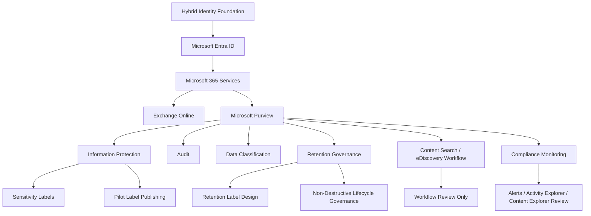

# Project 09 — Microsoft Purview Compliance, DLP, and Data Governance Baseline

## Introduction

This project builds a Microsoft Purview compliance and data governance baseline for Summit Ridge Manufacturing Group, a simulated hybrid Microsoft 365 organization.

Project 09 is the final project in the current portfolio sequence. It extends the previous identity, Microsoft 365, privileged access, and email security projects by adding Microsoft Purview governance capabilities for classification, audit, retention planning, compliance workflow documentation, and privacy-safe evidence handling.

The project focuses on realistic Microsoft 365 compliance administration while staying accurate about licensing and cost limitations. Hands-on work was completed where available, and features that required additional cost were documented transparently as design-only or workflow-only.

**Recommended portfolio title:** Microsoft Purview Compliance and Data Governance Baseline for a Hybrid Microsoft 365 Environment

---

## Objectives

The objectives of this project were to:

- Validate Microsoft Purview readiness and portal availability.
- Review compliance role groups without changing membership.
- Validate audit readiness and export sanitized audit evidence.
- Review data classification, Activity Explorer, Content Explorer, and compliance monitoring areas where available.
- Create or confirm a pilot sensitivity label model.
- Publish sensitivity labels to pilot users.
- Document DLP design while avoiding unsupported hands-on configuration due to licensing/cost constraints.
- Create or review retention labels with non-destructive lifecycle governance settings where available.
- Document retention label publishing as design-only due to licensing/cost constraints.
- Review Content Search and eDiscovery workflows without creating searches, cases, holds, or exports.
- Maintain privacy-safe evidence for a public GitHub portfolio.
- Complete the current portfolio project sequence at Project 09.

---

## Full Implementation

### Environment

| Area | Value |
|---|---|
| Organization | Summit Ridge Manufacturing Group |
| Microsoft 365 tenant | `democompany1016.onmicrosoft.com` |
| Verified public domain | `summitridge-mfg.com` |
| Identity source | On-premises AD synced to Microsoft Entra ID |
| Mail platform | Exchange Online |
| Compliance platform | Microsoft Purview |
| Pilot users | Emma Wilson, Olivia Brown, Sophia Martinez |
| Intune dependency | None |
| Compliant-device dependency | None |
| Project status | Final project in the current portfolio sequence |

### Pilot users

| User | Department | UPN |
|---|---|---|
| Emma Wilson | HR | `emma.wilson@summitridge-mfg.com` |
| Olivia Brown | Finance | `olivia.brown@summitridge-mfg.com` |
| Sophia Martinez | IT | `sophia.martinez@summitridge-mfg.com` |

### High-level architecture



### Project batches

| Batch | Scope | Final Treatment |
|---|---|---|
| Batch 1 | Project scope, licensing, compliance design, and folder structure | Completed |
| Batch 2 | Purview readiness, roles, audit baseline, and data classification inventory | Completed |
| Batch 3 | Sensitivity labels, label publishing, and information protection validation | Completed |
| Batch 4 | DLP design and limitation documentation | Completed as design-only |
| Batch 5 | Retention labels, retention planning, and lifecycle governance | Completed with publishing limitation |
| Batch 6 | Audit, Content Search/eDiscovery workflow, compliance monitoring | Completed as sanitized workflow review |
| Batch 7 | Final validation and README package | Completed |

### Repository structure

```text
projects/09-purview-compliance-dlp-governance/
├── README.md
├── data/
│   ├── project-09-policy-scope.csv
│   ├── project-09-risk-register.csv
│   ├── project-09-validation-checklist.csv
│   ├── project-09-final-architecture-summary.csv
│   └── project-09-final-compliance-outcomes.csv
├── evidence/
│   ├── command-outputs/
│   ├── screenshots/
│   └── validation-notes/
├── implementation/
│   ├── 01-business-scenario.md
│   ├── 02-compliance-governance-design.md
│   ├── 03-purview-rollout-plan.md
│   ├── 04-risk-and-rollback-plan.md
│   ├── 05-purview-readiness-roles-audit-classification-baseline.md
│   ├── 06-sensitivity-labels-label-publishing-baseline.md
│   ├── 07-dlp-design-only-licensing-limitation.md
│   ├── 08-retention-labels-lifecycle-governance-baseline.md
│   ├── 09-audit-ediscovery-compliance-monitoring.md
│   └── 10-project-09-final-validation-summary.md
└── scripts/
    └── powershell/
```

---

## Implementation Walkthrough

### 1. Project planning and compliance design

The project began by creating a dedicated GitHub project structure and local lab evidence folders. Initial planning documents were created to define the business scenario, governance design, rollout model, risk register, validation checklist, policy scope, and rollback controls.

Key planning outputs included:

- Business scenario document.
- Compliance governance design.
- Purview rollout plan.
- Risk and rollback plan.
- Policy scope CSV.
- Validation checklist CSV.
- Risk register CSV.
- README skeleton.

This planning phase established a pilot-first, privacy-safe, and non-destructive compliance implementation model.

### 2. Purview readiness and role review

Microsoft Purview readiness was validated by reviewing portal access, compliance PowerShell command availability, pilot mailbox readiness, audit configuration, and compliance role group visibility.

The following areas were reviewed:

- Microsoft Purview portal access.
- Exchange Online PowerShell connection.
- Purview compliance PowerShell connection.
- Purview command availability.
- Compliance role groups.
- Role group members.
- Pilot mailbox readiness.
- Audit configuration.
- Data classification overview.

No role group memberships were changed.

### 3. Audit baseline and sanitized audit evidence

Audit readiness was reviewed using Exchange Online and Microsoft Purview PowerShell. A sanitized unified audit baseline was exported.

The audit export included only:

- Creation date.
- User IDs.
- Operation.
- Workload.
- Result status.

The audit export intentionally excluded:

- `AuditData`
- `ObjectId`
- `ClientIP`
- Public IP address fields.
- Location fields.
- Private document references.
- Private email references.
- Message IDs.
- SharePoint or OneDrive URLs.

This allowed the project to demonstrate audit visibility without exposing private operational details.

### 4. Sensitivity labels

A four-label Microsoft Purview sensitivity label model was created or confirmed.

| Label | Purpose | Protection Intent |
|---|---|---|
| Public | Content approved for broad sharing | No encryption |
| Internal | Standard internal business content | Internal handling |
| Confidential | Sensitive internal business content | Classification and user awareness |
| Highly Confidential | Restricted business content | Strict handling guidance |

The label model was intentionally simple to avoid user confusion and unnecessary enforcement complexity.

The labels were configured or documented for:

- Files and emails.
- Manual user selection.
- No encryption enforcement.
- No auto-labeling.
- No mandatory labeling.
- No default label requirement.

### 5. Sensitivity label publishing

A pilot sensitivity label publishing policy was created or confirmed.

| Item | Result |
|---|---|
| Policy name | `P09-Pilot-Label-Publishing` |
| Scope | Pilot users |
| Labels published | Public, Internal, Confidential, Highly Confidential |
| Tenant-wide publishing | No |
| Mandatory labeling | No |
| Default label | None |
| Encryption enforcement | No |

This was the primary hands-on publishing configuration in Project 09.

### 6. DLP design-only documentation

DLP was documented as design-only because hands-on DLP configuration required additional licensing/cost in the lab tenant.

| Area | Result |
|---|---|
| DLP design matrix | Created |
| DLP portal area | Reviewed |
| DLP policy created | No |
| DLP rules created | No |
| DLP test mode enabled | No |
| DLP alerts generated | No |
| DLP enforcement validated | No |
| Reason | Licensing/cost limitation |

The project does not claim hands-on DLP policy configuration.

Accurate final treatment:

```text
DLP policy design was created, but hands-on DLP policy configuration was skipped due to licensing/cost constraints. No DLP policy, DLP rule, DLP test-mode validation, DLP alert, or DLP enforcement result is claimed.
```

### 7. Retention labels and lifecycle governance

Retention governance was designed around non-destructive lifecycle controls.

The following labels were planned or created/reviewed where available:

| Label | Intended Retention | Lifecycle Design |
|---|---|---|
| General Business Records | 3 years | Retain-only, non-destructive |
| HR Records | 7 years | Retain-only, non-destructive |
| Finance Records | 7 years | Retain-only, non-destructive |

The target lifecycle settings were:

| Setting | Result |
|---|---|
| Start retention period | When items were created |
| During retention | Retain items even if users delete |
| After retention period | Deactivate retention settings |
| Automatic deletion | No |
| Disposition review | No |
| Record declaration | No |
| Regulatory record declaration | No |
| Auto-apply | No |

### 8. Retention label publishing limitation

Retention label publishing was documented as design-only because publishing retention labels required additional licensing/cost in the lab tenant.

| Area | Result |
|---|---|
| Retention label publishing policy created | No |
| Retention labels published to users | No |
| Auto-apply policy created | No |
| Broad tenant retention policy created | No |
| Reason | Licensing/cost limitation |

The project does not claim that retention labels were published to users.

Accurate final treatment:

```text
Retention labels and lifecycle governance were designed with non-destructive controls. Hands-on retention label publishing was skipped due to licensing/cost constraints. No retention label publishing policy, auto-apply policy, broad retention policy, or destructive retention behavior is claimed.
```

### 9. Content Search and eDiscovery workflow

Content Search and eDiscovery were reviewed as workflow-only areas.

| Area | Final Treatment |
|---|---|
| Content Search portal area | Reviewed |
| Content Search created | No |
| Search query created | No |
| Search results exported | No |
| Result previews published | No |
| eDiscovery case created | No |
| eDiscovery hold created | No |
| eDiscovery export performed | No |

This approach avoided exposing private mailbox, SharePoint, OneDrive, Teams, or Microsoft 365 group content.

### 10. Compliance monitoring

Compliance monitoring areas were reviewed or documented where available:

| Area | Result |
|---|---|
| Compliance alerts | Reviewed or no-alert result documented |
| Activity Explorer | Reviewed or limitation documented |
| Content Explorer | Reviewed or limitation documented |
| Data classification | Reviewed |
| Audit portal | Reviewed |

A small lab tenant may show limited alerts or empty explorer data. These results were documented as acceptable lab limitations.

---

## Results & Validation

### Final architecture summary

| Component | Final Treatment | Status |
|---|---|---|
| Microsoft 365 tenant | Validated | Completed |
| Verified public domain | Validated | Completed |
| Pilot users | Used as compliance pilot scope | Completed |
| Microsoft Purview portal | Reviewed | Completed |
| Compliance role groups | Reviewed without changes | Completed |
| Audit configuration | Validated | Completed |
| Unified audit evidence | Exported with sanitized fields | Completed |
| Sensitivity labels | Created or confirmed | Completed |
| Sensitivity label publishing | Created for pilot users | Completed |
| DLP | Design-only due to licensing/cost limitation | Documented limitation |
| Retention labels | Created or reviewed where available | Completed |
| Retention label publishing | Design-only due to licensing/cost limitation | Documented limitation |
| Content Search | Reviewed only; no search created | Completed |
| eDiscovery | Reviewed only; no case, hold, search, or export created | Completed |
| Compliance monitoring | Reviewed or limitation documented | Completed |
| Privacy-safe evidence | Implemented | Completed |

### Final compliance outcomes

| Area | Final Outcome | Status |
|---|---|---|
| Purview readiness | Readiness reviewed and documented | Completed |
| Compliance roles | Role groups and members reviewed without membership changes | Completed |
| Audit | Sanitized audit evidence exported | Completed |
| Data classification | Reviewed or limitation documented | Completed |
| Sensitivity labels | Labels created or confirmed | Completed |
| Sensitivity label publishing | Published to pilot users | Completed |
| DLP | Documented as design-only due to licensing/cost constraints | Completed with limitation |
| Retention labels | Created or reviewed with non-destructive settings | Completed |
| Retention publishing | Skipped due to licensing/cost constraints | Completed with limitation |
| Retention governance | No deletion, disposition review, record, regulatory record, or auto-apply configured | Completed |
| Content Search | Reviewed only with no search created | Completed |
| eDiscovery | Reviewed only with no case, hold, search, or export created | Completed |
| Compliance monitoring | Reviewed or limitation documented | Completed |
| Evidence privacy | Private content, IP/location, previews, URLs, IDs excluded or sanitized | Completed |

### Final validated limitations

| Limitation Area | Final Treatment |
|---|---|
| DLP | Design-only due to licensing/cost limitation |
| Retention label publishing | Design-only due to licensing/cost limitation |
| Content Search | Workflow-only; no search created |
| eDiscovery | Workflow-only; no case, hold, search, or export created |
| Compliance alerts | Reviewed or no-alert result documented |
| Activity Explorer / Content Explorer | Reviewed or feature limitation documented |

### Privacy-safe evidence decisions

Project 09 did not export:

```text
IpAddress
Location
City
State
CountryOrRegion
ClientIP
AuditData
ObjectId
Private document content
Private email body content
Full message headers
Search result previews
Sensitive document previews
Sensitive message previews
SharePoint URLs
OneDrive URLs
Mailbox item IDs
Message IDs
Sensitive file names where avoidable
```

Screenshots were required to be cropped or blurred if they showed:

- Public IP address.
- Location.
- Device details.
- Session metadata.
- Private document text.
- Private email body content.
- Search result previews.
- Sensitive file names.
- SharePoint URLs.
- OneDrive URLs.
- Mailbox item IDs.
- Message IDs.
- Full user activity details.

---

## Validation Walkthrough

### Validation artifacts

| Evidence Type | Description |
|---|---|
| Command output | PowerShell validation outputs saved under `evidence/command-outputs/` |
| Screenshots | Sanitized portal screenshots saved under `evidence/screenshots/` |
| CSV files | Validation, risk, outcome, and architecture CSV files saved under `data/` |
| Implementation notes | Design and validation documents saved under `implementation/` |
| Final summary | Batch 7 final README preparation and validation summaries |

### Key validation files

| File | Purpose |
|---|---|
| `project-09-validation-checklist.csv` | Tracks implementation and validation status |
| `project-09-risk-register.csv` | Tracks risk treatment and accepted limitations |
| `project-09-final-architecture-summary.csv` | Summarizes final architecture and control treatment |
| `project-09-final-compliance-outcomes.csv` | Summarizes final compliance results |
| `10-project-09-final-validation-summary.md` | Final technical validation summary |
| `project-09-final-privacy-safe-evidence-note.txt` | Documents privacy-safe evidence rules |

### Final validation checklist highlights

The final validation confirmed:

- Batch 7 evidence folder was created.
- Final sensitivity label state was exported.
- Final sensitivity label publishing policy state was exported.
- Final retention label state was exported or limitation documented.
- Final DLP limitation state was validated.
- Final retention publishing limitation state was validated.
- Final architecture summary CSV was created.
- Final compliance outcomes CSV was created.
- Final privacy-safe evidence note was created.
- Final validation summary document was completed.
- DLP limitation was documented accurately.
- Retention publishing limitation was documented accurately.
- Content Search workflow was documented without search creation.
- eDiscovery workflow was documented without case, hold, search, or export creation.

### Final risk treatment highlights

The final risk register documented and treated these major risks:

| Risk | Treatment |
|---|---|
| DLP implementation overstated | README and validation documents state DLP is design-only |
| Retention publishing overstated | README and validation documents state retention publishing is design-only |
| Private content exposure | No private document/email content exported |
| IP/location exposure | IP/location fields excluded from public evidence |
| Content Search privacy exposure | No Content Search created or exported |
| eDiscovery privacy exposure | No eDiscovery case, hold, search, or export created |
| Retention destructive behavior | No deletion, disposition review, record, regulatory record, or auto-apply configured |
| Portfolio sequence ambiguity | Project 09 documented as final project in current sequence |

---

## Key Takeaways

Project 09 completed a realistic Microsoft Purview compliance and data governance baseline while accurately documenting licensing and privacy limitations.

The project demonstrates hands-on experience with:

- Microsoft Purview readiness review.
- Compliance role group review.
- Audit readiness validation.
- Sanitized unified audit evidence.
- Sensitivity label creation.
- Pilot sensitivity label publishing.
- Retention label design and non-destructive lifecycle governance.
- Compliance monitoring review.
- Risk register and validation checklist maintenance.
- Privacy-safe evidence handling for public portfolio documentation.

The project also demonstrates mature project judgment by clearly documenting design-only and limitation-based areas instead of overstating implementation.

Design-only or workflow-only areas were handled honestly:

- DLP was design-only due to licensing/cost constraints.
- Retention label publishing was design-only due to licensing/cost constraints.
- Content Search was workflow-only with no search created.
- eDiscovery was workflow-only with no case, hold, search, or export created.

This project supports real-world responsibilities for Microsoft 365 Administrator, Compliance Administrator, Security Administrator, IAM Administrator, and cloud governance roles.

Project 09 is the final project in the current portfolio sequence.
